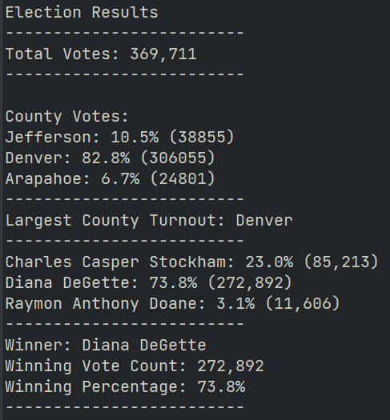

# election_analysis

## Project Overview of Analysis on Election Results using Python:

This project started due to a Colorado Board of Elections needing an automated election audit of a recent local congressional election. 
Along with the assistance of an employee of theirs, they had given me a list of outputs they wanted from the data they also provided to produce an audit. Once that had been completed, they requested additional data to complete the audit.

## Election Audit

### The Original Request

The following tasks were originally given to complete:

    1. Calculate the total number of votes cast
    2. Get a complete list of candidates who received votes.
    3. Calculate the total number of votes each candidate received.
    4. Calculate the percentage of votes each candidate won.
    5. Determine the winner of the election based on popular vote.

Utilizing `for` and `if` statements, a single page audit was constructed to display the data requested:

    - The total votes were calculated to: 369,711. This was saved to a file and printed to the terminal.

    - To make clear of the data, the list of candidates was printed with each candidate’s total votes received,
    and the percentage of votes each candidate won printed beside the candidate’s name.
    The output:

    Charles Casper Stockham: 23.0% (85,213)
    Diana DeGette: 73.8% (272,892)
    Raymon Anthony Doane: 3.1% (11,606)

    - This was then summed up with the winner printed with their winning vote count and winning percentage:

    Winner: Diana DeGette
    Winning Vote Count: 272,892
    Winning Percentage: 73.8%

### Adapting the Code for Additional Tasks

Since the original audit output was a success, the election commission requested more data regarding each county that was voted in. The tasks to complete the further audit involved; the counties that were voted in, how many people turned out per county, what was that percentage out of the total votes, and the county with the highest turnout. Further utilizing `for` loops and `if` statements, the new data was added to the original analysis in the same format as the already establised data structure:

    -The voter turnout for each county was calculated and the percentage of votes from each county printed alongside it:

    Jefferson: 10.5% (38855)
    Denver: 82.8% (306055)
    Arapahoe: 6.7% (24801)

    -Finally, the "winner" of the counties with the most turnout was displayed:

    Largest County Turnout: Denver

As with the original analysis, this was printed to the terminal and saved to a separate text file for review:

## Summary of the Audit

By the Colorado Board of Elections request, a script was created to take voter data from 3 counties and tabulate criteria consisting of total number of votes cast, list the candidates with total votes received, that percentage, and finally determine the winner by popular vote.
For the election commissions benefit, this code can be reutilized in several other ways, since the code is set up in a way that the variables can be easily changed. Things like audits of specific Districts, or even being scaled up to a federal level is possibility with this code. Adding more conditions is a reality, since the framework is already established. There could even be more discussion on how this script could be used for any election, besides the two given examples.
